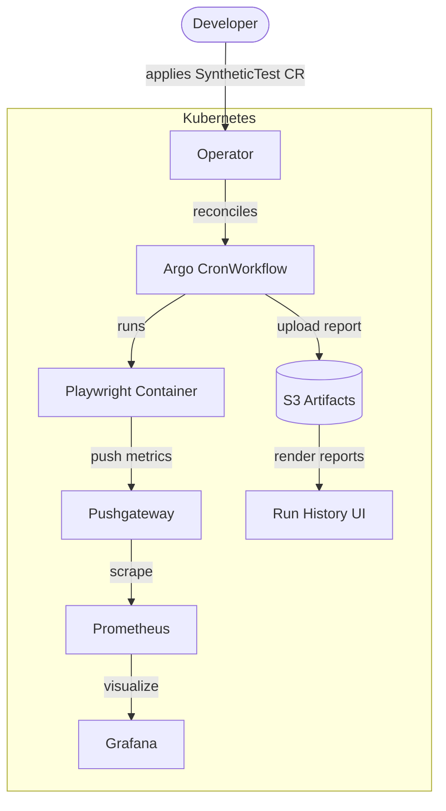

# The Grid — Product Roadmap

A competitive cloud-native synthetic testing platform built on Argo Workflows and Playwright.
The goal: Datadog Synthetics, but open, cheap, and developer-friendly.

## Current State

- Single Playwright test (`http-bin.spec.ts`) running every 5 minutes via Argo `CronWorkflow`
- `prom-client` metrics pushed to Prometheus Pushgateway after each run
- k3s on a single EC2 t4g.medium (ARM64), ArgoCD GitOps, Terraform-provisioned
- No artifact storage, no UI beyond Argo Workflows and raw Prometheus

---

## Milestones

### 1. S3 Artifact Upload

**Goal:** Every test run produces browsable screenshots, HTML reports, and traces.

Playwright already generates an HTML report with embedded screenshots and traces — it just never goes anywhere.

- Add a post-run step to the Argo `CronWorkflow` that runs `aws s3 sync playwright-report/ s3://the-grid-artifacts/<workflow-id>/`
- Provision an S3 bucket and IRSA role (Terraform) for the workflow service account
- Optionally expose reports via presigned URLs or CloudFront

**Why first:** This is the Datadog feature users actually pay for. Once artifacts are in S3, a UI is just a list of links.

---

### 2. Shared Instrumentation Library (`src/lib/synthetics`)

**Goal:** Any developer can write a synthetic test and get metrics, artifact upload, and Pushgateway push for free — no boilerplate.

```typescript
// Before: prom-client code embedded in every test file
// After:
import { test, expect } from "../lib/synthetics";

test("homepage loads", async ({ page }) => {
  await page.goto("https://example.com");
  await expect(page).toHaveTitle(/Example/);
});
// ^^ automatic step timing, histogram push, labels
```

- Wrap Playwright's `test` fixture to auto-instrument `test.step()` calls with a Prometheus Histogram
- Standardize labels: `test_suite`, `step_name`, `status`, `environment`
- Push to Pushgateway in `afterEach` based on env vars (same as today, but centralized)

**Why second:** Prerequisite for scaling to more tests without copy-paste metrics code.

---

### 3. Grafana Dashboard

**Goal:** Real-time visibility into uptime, latency, and failure rates without building a custom UI.

- Add Grafana to the kube-prometheus stack (community chart, one ArgoCD Application)
- Dashboard: uptime %, p50/p95 step latency per test, failure rate over time, recent failures

**Why third:** Already have Prometheus. Grafana is a one-afternoon win that gives the platform a real observability layer.

---

### 4. Kubernetes Operator (`SyntheticTest` CRD)

**Goal:** Tests are first-class Kubernetes objects. Adding a synthetic means applying a CR, not editing Helm values.

```yaml
apiVersion: grid.theone.io/v1alpha1
kind: SyntheticTest
metadata:
  name: httpbin-http-methods
spec:
  schedule: "*/5 * * * *"
  image: 393657359434.dkr.ecr.us-east-2.amazonaws.com/flynn/playwright-synthetics:latest
  testFilter: "http-bin"
  pushgatewayUrl: http://playwright-synthetics-prometheus-pushgateway:9091
  artifactsBucket: the-grid-artifacts
  resources:
    requests:
      cpu: 250m
      memory: 512Mi
```

The operator reconciles `SyntheticTest` → Argo `CronWorkflow` + supporting config.
Delete the CR, the CronWorkflow is cleaned up. Update the schedule, operator patches it.

- Scaffold with kubebuilder (Go + controller-runtime)
- `SyntheticTest` controller: reconcile → create/update/delete `CronWorkflow`
- Optionally add `SyntheticTestRun` to mirror completed workflow runs (gives UI a structured API)
- Deploy operator via ArgoCD

**Why fourth:** Transforms the platform from "a test runner" into "a platform with an API." Also the prerequisite for a useful custom UI.

---

### 5. Run History UI

**Goal:** Browse test runs, view screenshots and traces, see pass/fail history — Datadog Synthetics UX without the Datadog bill.

- List `SyntheticTest` resources and their recent runs (from `SyntheticTestRun` CRs or Argo API)
- Link to S3-hosted HTML reports per run
- Show embedded screenshots for failures
- Simple read-only web app (React or similar), served from the cluster

**Why last:** Depends on artifacts (step 1), the operator's structured API (step 4), and a reason to exist beyond what Grafana already shows.

---

## Architecture (target state)


