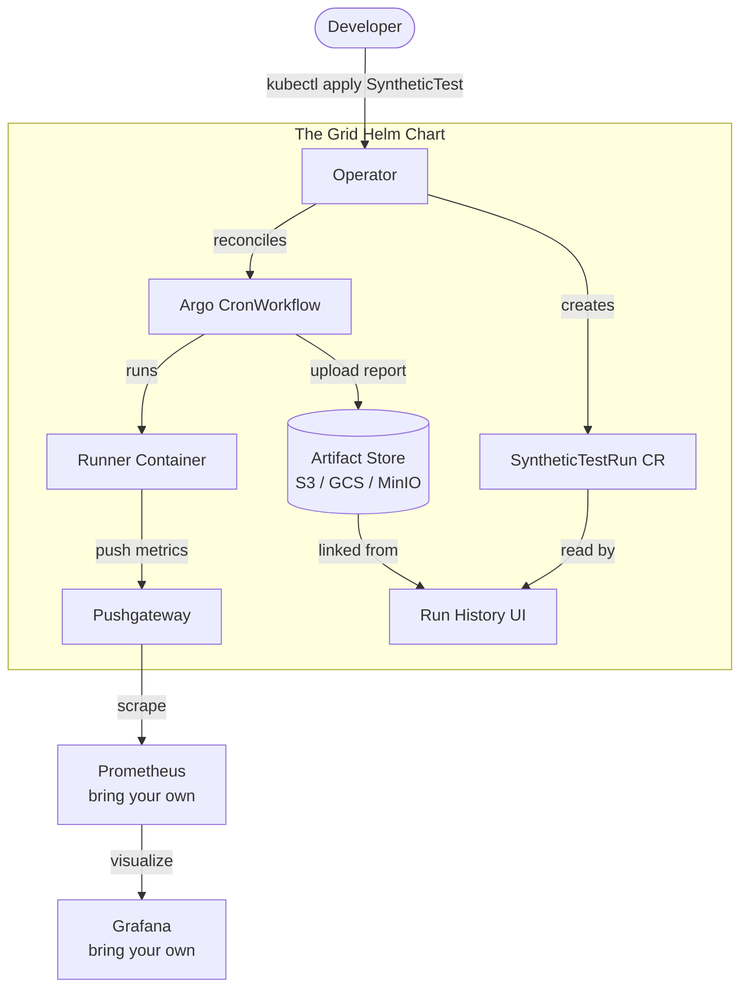

# The Grid — Product Roadmap

A competitive cloud-native synthetic testing platform built on Argo Workflows and Playwright.
The goal: Datadog Synthetics, but open, self-hosted, and developer-friendly.

## Vision

A user has a Kubernetes cluster. Maybe they already have Prometheus and Grafana, maybe something else.
They install one Helm chart, write Playwright tests, apply `SyntheticTest` CRs, and they're running
synthetic monitors. The UI comes with the chart. Metrics flow into whatever observability stack they
already have.

```bash
helm install the-grid oci://ghcr.io/the-grid/the-grid \
  --set argo-workflows.enabled=true \
  --set pushgateway.enabled=true
```

---

## Dev Environment

The current EC2/k3s setup is the proving ground for building the platform, not the product itself.

- Single Playwright test (`http-bin.spec.ts`) running every 5 minutes via Argo `CronWorkflow`
- `prom-client` metrics pushed to Prometheus Pushgateway after each run
- k3s on a single EC2 t4g.medium (ARM64), ArgoCD GitOps, Terraform-provisioned
- No artifact storage, no UI beyond Argo Workflows and raw Prometheus

---

## Milestones

### 0. Platform Packaging

**Goal:** Define the Helm chart structure and distribution pipeline. Everything else is a feature of the chart.

The chart ships everything a user needs and nothing they don't:

| Component                                  | Default   | Toggle                   |
| ------------------------------------------ | --------- | ------------------------ |
| CRDs (`SyntheticTest`, `SyntheticTestRun`) | always on | —                        |
| Operator                                   | always on | —                        |
| UI                                         | always on | `ui.enabled`             |
| Argo Workflows                             | on        | `argo-workflows.enabled` |
| Prometheus Pushgateway                     | on        | `pushgateway.enabled`    |

**Distribution:**

- Operator and UI images published to `ghcr.io/the-grid/`
- Helm chart published as an OCI artifact to `ghcr.io/the-grid/charts/the-grid`
- Chart versioned with semver, CI builds on every merge to main

---

### 1. Shared Instrumentation Library (`@the-grid/synthetics`)

**Goal:** Any developer can write a synthetic test and get metrics for free — no boilerplate.

```typescript
// Before: prom-client code embedded in every test file
// After:
import { test, expect } from "@the-grid/synthetics";

test("homepage loads", async ({ page }) => {
  await page.goto("https://example.com");
  await expect(page).toHaveTitle(/Example/);
});
// ^^ automatic step timing, histogram push, standardized labels
```

- Wrap Playwright's `test` fixture to auto-instrument `test.step()` calls with a Prometheus Histogram
- Standardize labels: `test_suite`, `step_name`, `status`, `environment`
- Push to Pushgateway in `afterEach` via `PUSHGATEWAY_URL` env var
- Published to npm as `@the-grid/synthetics`

**Why first:** Prerequisite for everything else. Standardized metrics unlock Grafana dashboards.
Also the primary developer-facing API — nail this before building the rest of the platform on top of it.

---

### 2. Kubernetes Operator (`SyntheticTest` CRD)

**Goal:** Tests are first-class Kubernetes objects. Adding a synthetic means `kubectl apply`, not editing Helm values.

The operator reconciles `SyntheticTest` → Argo `CronWorkflow` + supporting config.
Delete the CR, the CronWorkflow is cleaned up. Update the schedule, the operator patches it.

#### Test source model

The runner image contains the Playwright runtime (browsers, node_modules) but no test files.
Test source is injected at pod startup via one of two strategies, chosen per CR:

**Inline** — test source embedded in the CR, stored as a `ConfigMap`, mounted at `/app/tests/`.
Best for getting started and quick iteration.

```yaml
apiVersion: grid.theone.io/v1alpha1
kind: SyntheticTest
metadata:
  name: httpbin-http-methods
spec:
  schedule: "*/5 * * * *"
  source:
    inline: |
      import { test, expect } from '@the-grid/synthetics'

      test('GET returns 200', async ({ page }) => {
        await test.step('navigate', () => page.goto('https://httpbin.org'))
        await expect(page).toHaveTitle(/httpbin/)
      })
```

**S3** — versioned test bundle uploaded via CI, downloaded by an init container at pod startup.
Best for test suites with a real publish pipeline.

```yaml
apiVersion: grid.theone.io/v1alpha1
kind: SyntheticTest
metadata:
  name: httpbin-http-methods
spec:
  schedule: "*/5 * * * *"
  source:
    s3:
      bucket: my-test-suites
      key: httpbin/v1.4.2/tests.tar.gz
```

#### Local development

No change — `make test` runs `npx playwright test` from `src/` directly.
Image rebuilds are only needed when runtime deps (browsers, node_modules) change.

#### Implementation

- Scaffold with kubebuilder (Go + controller-runtime)
- `SyntheticTest` controller: reconcile → `ConfigMap` (inline) or init container (S3) + `CronWorkflow`
- `SyntheticTestRun` CR mirrors completed workflow runs — gives the UI a structured API without hitting Argo directly
- Deployed as part of the Helm chart

---

### 3. Artifact Storage

**Goal:** Every test run produces browsable screenshots, HTML reports, and traces stored durably.

Playwright already generates an HTML report with embedded screenshots and traces — it just never goes anywhere.

- Post-run step in the Argo `CronWorkflow` uploads `playwright-report/` to the configured artifact bucket
- Report path: `<bucket>/<test-name>/<workflow-id>/`
- `SyntheticTestRun` CR records the S3 path so the UI can link directly to it
- Works with any S3-compatible store (AWS S3, GCS with interop, MinIO for on-prem)

**Why:** This is the Datadog feature users actually pay for. Once artifacts are in S3, the UI is just a list of links.

---

### 4. Grafana Dashboard

**Goal:** Out-of-the-box observability for anyone already running Grafana.

- Grafana dashboard JSON shipped with the chart, auto-provisioned if Grafana is available
- Dashboard: uptime %, p50/p95 step latency per test, failure/flake rate over time
- `ServiceMonitor` included so kube-prometheus-stack picks up the Pushgateway automatically

**Why:** Users bring their own Grafana. Give them a dashboard that just works on install.

---

### 5. Run History UI

**Goal:** Browse test runs, view screenshots and traces, see pass/fail history — without leaving the cluster.

- Lists `SyntheticTest` resources and recent `SyntheticTestRun` CRs
- Links to S3-hosted HTML reports per run
- Embedded screenshots for failures
- Ships as a container in the Helm chart, exposed via `Service` + optional `Ingress`

#### Auth

Auth is a real problem for a self-hosted UI. Shipped in phases:

| Phase | Mode   | Notes                                                                                                         |
| ----- | ------ | ------------------------------------------------------------------------------------------------------------- |
| 1     | `none` | No auth, prominent warning. Fine for internal clusters with network-level controls.                           |
| 2     | `oidc` | One `values.yaml` block: clientID, secret, issuer URL. Works with Okta, Google, Dex, anything OIDC-compliant. |

---

## Architecture (target state)


